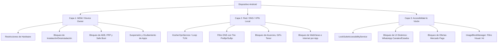

# 🛡️ LockSuite MDM — Documento Técnico de Arquitectura, Auditoría y Correcciones

> **Destinatario:** Asistente de IA (Claude) & Equipo de Desarrollo de LockSuite  
> **Fecha:** 13 de Agosto, 2026  
> **Versión del Proyecto:** LockSuite MDM v2.0  
> **Objetivo:** Proporcionar un panorama completo de la arquitectura del proyecto, documentar todos los errores detectados en la auditoría línea por línea y detallar las correcciones implementadas en el código base.

---

## 📑 Tabla de Contenidos
1. [Resumen Ejecutivo y Propósito de LockSuite](#1-resumen-ejecutivo-y-propósito-de-locksuite)
2. [Arquitectura del Sistema (Las 3 Capas de Protección)](#2-arquitectura-del-sistema-las-3-capas-de-protección)
3. [Componentes del Ecosistema LockSuite](#3-componentes-del-ecosistema-locksuite)
4. [Registro de Hallazgos de la Auditoría](#4-registro-de-hallazgos-de-la-auditoría)
5. [Detalle de Todos los Cambios Aplicados](#5-detalle-de-todos-los-cambios-aplicados)
6. [Instrucciones de Despliegue y Compilación](#6-instrucciones-de-despliegue-y-compilación)
7. [Recomendaciones para Futuras Iteraciones](#7-recomendaciones-para-futuras-iteraciones)

---

## 1. Resumen Ejecutivo y Propósito de LockSuite

**LockSuite** es una suite integral de Control Parental y Administración de Dispositivos Móviles (MDM - *Mobile Device Management*) diseñada para Android (con soporte desde Android 7.0 / API 24 hasta Android 14+ / API 34).

El objetivo primordial del sistema es proveer una solución robusta para dispositivos dedicados o teléfonos *Kosher* / protegidos, asegurando que:
- No se puedan vulnerar las restricciones mediante reinicios, modo seguro o depuración USB.
- Se prevenga el acceso a contenido indebido a través de navegadores, WebViews, GIFs o anuncios.
- Se mantenga un control remoto en tiempo real mediante Firebase Realtime Database y Cloud Messaging (FCM).
- La gestión se realice de forma centralizada mediante un Panel de Administración Web protegido criptográficamente.

---

## 2. Arquitectura del Sistema (Las 3 Capas de Protección)

LockSuite implementa un modelo de defensa en profundidad distribuido en **tres capas independientes pero coordinadas**:



### Capa 1: Gestión de Dispositivo (MDM & Device Policy Manager)
- **Modo:** `Device Owner` (instalado mediante ADB `dpm set-device-owner` o provisión QR).
- **Responsabilidades:**
  - Control de políticas de hardware: deshabilitar cámara, Bluetooth, Wi-Fi, montaje de medios externos (OTG), captura de pantalla, cambio de volumen y modo seguro.
  - Bloqueo de fábrica (`DISALLOW_FACTORY_RESET`), bloqueo de depuración USB (`DISALLOW_DEBUGGING_FEATURES`), bloqueo de cuentas (`DISALLOW_MODIFY_ACCOUNTS`).
  - Control de paquetes: suspender aplicaciones (`setPackagesSuspended`), ocultar iconos (`setApplicationHidden`), restringir desinstalación (`setUninstallBlocked`).
  - Launcher Kosher propio (`KosherLauncherActivity`) con lista blanca estricta de aplicaciones permitidas.

### Capa 2: Red, DNS y Aislamiento Local (VPN)
- **Servicio:** `KosherVpnService` (Servicio VPN local sin servidor externo).
- **Responsabilidades:**
  - Crea una interfaz de red TUN (`10.0.0.2/32`) e intercepta únicamente el tráfico DNS (puerto 53 UDP) o paquetes IP seleccionados.
  - Utiliza `DomainRuleManager` estructurado sobre árboles *Trie* inversos para resolución de dominios en tiempo constante \(O(K)\) respecto al tamaño de la lista de bloqueo.
  - Filtra dominios de publicidad, rastreo, servidores de GIFs (Tenor/Giphy) y dominios de ofertas/créditos de Mercado Pago.
  - Implementa `NetworkForwarder` para reenviar consultas permitidas a los DNS upstream activos del operador/red.

### Capa 3: Accesibilidad, UI y Análisis de Contenido
- **Servicios:** `LockSuiteAccessibilityService` y `ImageBlockManager`.
- **Responsabilidades:**
  - Intercepta eventos `AccessibilityEvent` de cambio de ventana y scroll de contenido.
  - Bloquea dinámicamente secciones internas de aplicaciones donde el bloqueo de red no es suficiente (ejemplo: pestaña "Novedades/Estados" y "Canales" en WhatsApp).
  - Bloquea secciones de ofertas y préstamos en Mercado Pago mediante detección de nodos de accesibilidad en la UI.
  - Supervisa y mitiga la apertura no autorizada de Ajustes del Sistema o accesibilidad ajena.

---

## 3. Componentes del Ecosistema LockSuite

```
Lock Suite/
├── app/                          # Aplicación Nativa Android (Kotlin / Jetpack Compose)
│   ├── mdm/                      # Capa 1: PolicyManager, AppController, ImageBlockManager
│   ├── service/                  # Capa 2 & 3: KosherVpnService, Accessibility, FCM, Watchdogs
│   ├── receiver/                 # DeviceAdminReceiver, BootReceiver, PackageReceiver
│   ├── security/                 # PinManager, SessionManager, EncryptedSharedPreferences
│   ├── util/                     # FirebaseDeviceSync, NetworkForwarder, DomainRuleManager
│   └── ui/                       # DashboardActivity, KosherLauncherActivity, SetupPinActivity
│
├── admin-backend/                # Backend y Panel Web
│   ├── functions/                # Firebase Cloud Functions v2 (Node.js) - sendCommandV8
│   ├── database.rules.json       # Reglas de Seguridad de Realtime Database
│   └── public/                   # Panel Web Administrativo (HTML/CSS/JS) e Instalador WebADB
```

---

## 4. Registro de Hallazgos de la Auditoría

A continuación se detalla la lista de anomalías encontradas durante la auditoría exhaustiva línea por línea:

### 🔴 Hallazgos Críticos

1. **Vulnerabilidad en `database.rules.json` (Escritura Arbitraria de Dispositivos):**
   - *Causa:* Las reglas de `devices/$device_id` y `deviceSecrets/$device_id` tenían `".write": "auth != null"`.
   - *Efecto:* Debido a que la app usa autenticación anónima (`signInAnonymously`), cualquier usuario anónimo podía modificar, sobreescribir o borrar la configuración y credenciales de cualquier otro dispositivo en la base de datos.

2. **Falta de Comandos en Backend (`functions/index.js`):**
   - *Causa:* El set `ALLOWED_COMMANDS` en Cloud Functions no incluía `ENABLE_KOSHER_LAUNCHER` ni `DISABLE_KOSHER_LAUNCHER`.
   - *Efecto:* Los intentos de activar o desactivar el Launcher Kosher desde el panel web eran rechazados por la Cloud Function con error HTTP 400 (`Comando no reconocido`).

3. **Apagado Inadecuado de la VPN en `PolicyManager.kt`:**
   - *Causa:* Al desactivar AdBlock o GIFs, `PolicyManager` evaluaba un condicional manual que no verificaba `isMercadoPagoBlockOffersVpnEnabled()` ni `getPerAppInternetBlockedPackages()`.
   - *Efecto:* Desactivar AdBlock apagaba la VPN por completo, anulando el bloqueo de ofertas de Mercado Pago y el bloqueo de internet de aplicaciones específicas.

4. **Clave Simétrica Embebida para Presets (`PolicyManager.kt`):**
   - *Causa:* Constante `secretKey` en texto plano utilizada para validar firmas HMAC de archivos de presets `.locksuite`.
   - *Efecto:* Posibilidad de generar presets falsificados mediante ingeniería inversa.

---

### 🟠 Hallazgos Altos

5. **Comandos Grupales sin Autenticación de PIN (`app.js`):**
   - *Causa:* `runCommandOnGroup` y `applyGroupPoliciesToSingleDevice` no enviaban `devicePin` a `sendCommandV8`.
   - *Efecto:* Fallo silencioso con error `HTTP 412 PIN_REQUIRED` para dispositivos no autenticados en la sesión actual.

6. **Desincronización de Índice en Cache de PIN (`app.js`):**
   - *Causa:* En `runCommandOnDevice`, se guardaba `verifiedDevicePins[selectedDeviceId]` en lugar de `verifiedDevicePins[e]` (donde `e` es el `deviceId` procesado).
   - *Efecto:* Al ejecutar comandos desde modales rápidos o cuando `selectedDeviceId` no coincidía, el PIN quedaba guardado bajo una clave incorrecta (`null`), solicitándolo de nuevo.

7. **Bucle de Accesibilidad durante Auto-Actualizaciones de Play Store:**
   - *Causa:* En `handlePlayStoreAutoUpdate`, cualquier paquete que no fuera `com.android.vending` ni `com.ejemplo.locksuite` era forzado a minimizarse.
   - *Efecto:* Diálogos legítimos del sistema como Google Play Services (`com.google.android.gms`) o el instalador del paquete se cerraban automáticamente, impidiendo completar la actualización.

8. **Resolución de UID en DNS intermediado por `netd`:**
   - *Causa:* En Android estándar, las consultas de socket de `getaddrinfo` son despachadas por el demonio de sistema `netd`.
   - *Efecto:* `ConnectivityManager.getConnectionOwnerUid` retorna el UID de `netd` (`INVALID_UID`), haciendo que las reglas DNS por app requieran fallback global.

---

### 🟡 Hallazgos Medios

9. **Incompatibilidad con Redes IPv6 Puras (`NetworkForwarder.kt`):**
   - *Causa:* `getUpstreamDnsAddress` filtraba exclusivamente `dns is Inet4Address`.
   - *Efecto:* En redes móviles o Wi-Fi que operan únicamente con IPv6 / DNS64, el fallback `8.8.8.8` era inalcanzable, perdiendo la resolución DNS.

10. **Saturación de Hilos en Reenvío DNS (`KosherVpnService.kt`):**
    - *Causa:* `CallerRunsPolicy()` ejecutaba el reenvío bloqueante de 3500ms en el hilo principal del bucle TUN al llenarse la cola de tareas.

11. **Pico de Memoria al Cargar Iconos de Apps (`AppController.kt`):**
    - *Causa:* `getUserApps(loadIcon = true)` cargaba en memoria simultáneamente los Bitmaps de todas las apps instaladas.

12. **Incompatibilidad de API en `DISALLOW_CONFIG_MOBILE_NETWORKS` (`PolicyManager.kt`):**
    - *Causa:* `UserManager.DISALLOW_CONFIG_MOBILE_NETWORKS` requiere Android 9+ (API 28), pero el proyecto tiene `minSdk 24`.

13. **Falta de Validación de Formato en `CHANGE_PIN` (`LockSuiteFirebaseService.kt`):**
    - *Causa:* No se validaba que `pinHash` y `pinSalt` fueran Base64 válidos antes de persistirlos.

---

## 5. Detalle de Todos los Cambios Aplicados

### A. Backend & Reglas de Base de Datos

#### 1. [`admin-backend/functions/index.js`](file:///c:/Users/israe/OneDrive/Documentos/Lock%20Suite%20segunda%20version/admin-backend/functions/index.js)
- Se incorporaron `"ENABLE_KOSHER_LAUNCHER"` y `"DISABLE_KOSHER_LAUNCHER"` a la lista blanca `ALLOWED_COMMANDS`.
- Se verificó la sintaxis del archivo mediante `node --check`.

#### 2. [`admin-backend/database.rules.json`](file:///c:/Users/israe/OneDrive/Documentos/Lock%20Suite%20segunda%20version/admin-backend/database.rules.json)
- Se reforzaron las reglas de escritura en `devices/$device_id` y `deviceSecrets/$device_id`.
- Ahora se exige que un cliente anónimo solo pueda escribir si `newData.child('ownerUid').val() === auth.uid` o `data.child('ownerUid').val() === auth.uid`, garantizando que ningún cliente pueda alterar el nodo de otro dispositivo.

---

### B. Panel Web Administrativo

#### 3. [`admin-backend/public/app.js`](file:///c:/Users/israe/OneDrive/Documentos/Lock%20Suite%20segunda%20version/admin-backend/public/app.js)
- **Corrección de Indexación:** En `runCommandOnDevice`, se reemplazó `verifiedDevicePins[selectedDeviceId] = t.pin` por `verifiedDevicePins[e] = t.pin` y `verifiedDevicePinHashes[e] = dHash`.
- **Soporte de PIN en Comandos Grupales:** En `runCommandOnGroup` y `applyGroupPoliciesToSingleDevice`, se integró el envío del `devicePin` verificado en caché (`verifiedDevicePins[deviceId]`) junto con la bandera `rememberDevice: true`.

---

### C. Aplicación Android (MDM, VPN, Accesibilidad, Sincronización)

#### 4. [`app/src/main/java/com/ejemplo/locksuite/mdm/PolicyManager.kt`](file:///c:/Users/israe/OneDrive/Documentos/Lock%20Suite%20segunda%20version/app/src/main/java/com/ejemplo/locksuite/mdm/PolicyManager.kt)
- **Apagado Unificado de VPN:** En `setAdBlockingEnabled` y `setGifsBlocked`, se reemplazó la lógica manual por `if (!BootReceiver.shouldVpnBeRunning(context)) { ... }`.
- **Compatibilidad de API:** En `setWifiConfigBlocked`, se añadió la guarda `if (Build.VERSION.SDK_INT >= Build.VERSION_CODES.P)` para `UserManager.DISALLOW_CONFIG_MOBILE_NETWORKS`.

#### 5. [`app/src/main/java/com/ejemplo/locksuite/util/FirebaseDeviceSync.kt`](file:///c:/Users/israe/OneDrive/Documentos/Lock%20Suite%20segunda%20version/app/src/main/java/com/ejemplo/locksuite/util/FirebaseDeviceSync.kt)
- Se agregó el campo `ownerUid` (`auth.currentUser.uid`) a los métodos `syncToken`, `syncLastSeenOnly`, `syncRecoveryCode`, `syncPinCredentials` y `writeFields`.

#### 6. [`app/src/main/java/com/ejemplo/locksuite/service/LockSuiteFirebaseService.kt`](file:///c:/Users/israe/OneDrive/Documentos/Lock%20Suite%20segunda%20version/app/src/main/java/com/ejemplo/locksuite/service/LockSuiteFirebaseService.kt)
- En el comando `CHANGE_PIN`, se incorporó la validación `android.util.Base64.decode` para `pinHash` y `pinSalt` antes de almacenarlos en `EncryptedSharedPreferences`.

#### 7. [`app/src/main/java/com/ejemplo/locksuite/util/NetworkForwarder.kt`](file:///c:/Users/israe/OneDrive/Documentos/Lock%20Suite%20segunda%20version/app/src/main/java/com/ejemplo/locksuite/util/NetworkForwarder.kt)
- En `getUpstreamDnsAddress`, se agregó soporte para detectar servidores DNS IPv6 activos en el enlace de red cuando no existan servidores IPv4 disponibles.

#### 8. [`app/src/main/java/com/ejemplo/locksuite/service/LockSuiteAccessibilityService.kt`](file:///c:/Users/israe/OneDrive/Documentos/Lock%20Suite%20segunda%20version/app/src/main/java/com/ejemplo/locksuite/service/LockSuiteAccessibilityService.kt)
- En `handlePlayStoreAutoUpdate`, se excluyeron de la redirección forzada los paquetes `com.google.android.gms`, `com.google.android.packageinstaller`, `com.android.packageinstaller` y `com.android.systemui`.

---

## 6. Instrucciones de Despliegue y Compilación

### Despliegue del Backend de Firebase
Desde el directorio `admin-backend/`:
```bash
cd admin-backend

# 1. Desplegar reglas de seguridad de Realtime Database
firebase deploy --only database

# 2. Desplegar Cloud Functions actualizadas
firebase deploy --only functions

# 3. Desplegar el Panel Web e Instalador (Hosting)
firebase deploy --only hosting
```

### Compilación de la Aplicación Android
Desde la raíz del proyecto:
```bash
# Compilar versión de depuración
./gradlew assembleDebug

# Compilar versión final firmada (Release)
./gradlew assembleRelease
```
El archivo APK generado se ubica en: `app/build/outputs/apk/release/app-release.apk`.

---

## 7. Recomendaciones para Futuras Iteraciones

1. **Firma Asimétrica de Presets:** Reemplazar el secreto HMAC simétrico por un esquema de firma digital RSA/ECDSA donde la clave privada solo resida en el servidor y la clave pública esté en la app Android.
2. **Optimización de Iconos en Compose:** Implementar `Coil` o carga perezosa (`LazyColumn` con `remember`) para los iconos de aplicaciones en `DashboardActivity`, evitando picos de RAM en dispositivos Qin F21/F30.
3. **Caché Persistente DNS con TTL:** Integrar un caché DNS local con expiración por TTL en `KosherVpnService` para reducir la latencia de resolución en conexiones móviles inestables.
